# padelerodouleies — User Documentation

> A self-hosted, gamified chore-and-reward web app for the family. Kids complete
> chores to earn ⭐ stars, spend them in a marketplace, and climb a live
> leaderboard. Parents create chores and rewards, approve claims, and keep an eye
> on everything from any device on the home network.

This guide is written for the people who actually use the app — **parents**
(admins) and **kids** (users). For deployment, CI/CD, and developer setup, see the
project [`README.md`](../README.md) and [`CLAUDE.md`](../CLAUDE.md) in the repo
root.

## Contents

- [At a glance](#at-a-glance)
- [Logging in (the Fast Switcher)](#logging-in-the-fast-switcher)
- [For kids](#for-kids)
  - [Dashboard & chores](#dashboard--chores)
  - [Claiming a chore](#claiming-a-chore)
  - [Marketplace](#marketplace)
  - [History](#history)
  - [Leaderboard](#leaderboard)
  - [Stats](#stats)
- [For parents (admin)](#for-parents-admin)
  - [Approvals](#approvals)
  - [Managing chores](#managing-chores)
  - [Managing rewards](#managing-rewards)
  - [Managing users](#managing-users)
  - [Fulfillment](#fulfillment)
  - [Activity log](#activity-log)
- [Personal settings (everyone)](#personal-settings-everyone)
- [On phones & tablets](#on-phones--tablets)
- [Architecture overview](#architecture-overview)

---

## At a glance

| Who | Can do |
|---|---|
| **Kids** (`user` role) | See available chores, claim them, browse and redeem rewards, view their history, leaderboard and stats. |
| **Parents** (`admin` role) | Everything kids can do, plus approve/decline claims, create & edit chores and rewards, manage users, fulfil redeemed rewards, and read the full activity log. |

Two ideas drive the whole experience:

- **Stars (⭐)** are the currency. Chores earn them, rewards cost them.
- **Nothing is wasted or hidden.** Every star that moves leaves a visible row in a
  history ledger — including retroactive declines, which show up as a clear negative
  entry the child can read.

The interface is **bilingual** (Greek by default, English secondary) — toggle the
language anytime with the **🌐 English / Ελληνικά** button in the top-right.

---

## Logging in (the Fast Switcher)

The app is designed for a shared family tablet, so there are no usernames or
passwords to type — just **tap your face and enter a 4-digit PIN**.

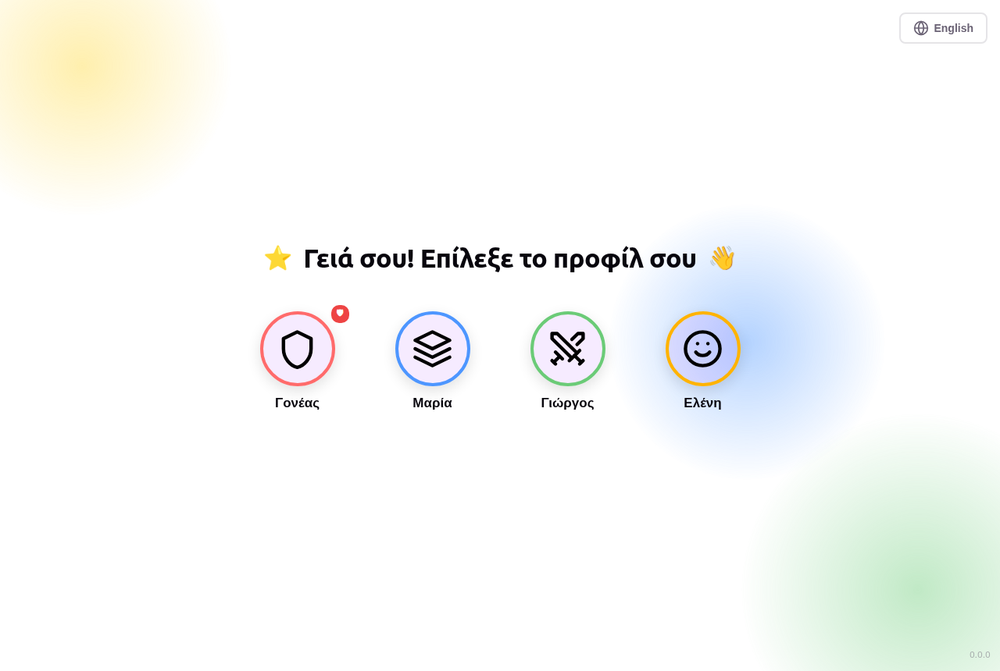

1. **Pick your profile.** The landing screen shows a big circle for every family
   member. Parents have a 🛡 shield badge.
2. **Tap in your PIN.** A giant 3×4 numeric keypad slides up. Enter your four
   digits.

   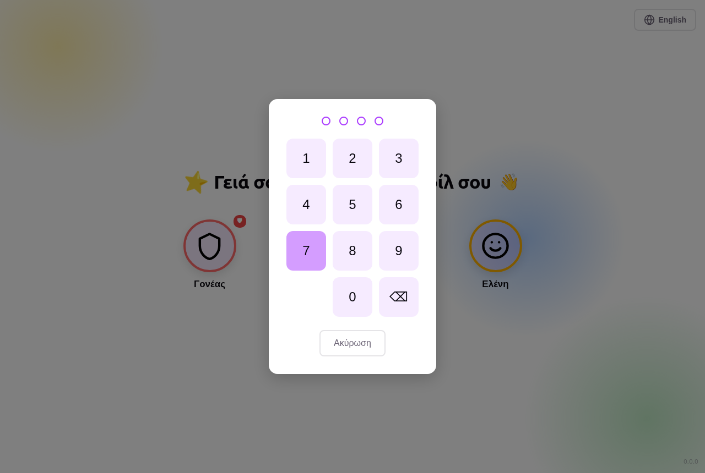

3. **Instant verify.** The moment the 4th digit lands, you're logged in — no
   "submit" button. A wrong PIN shakes red and clears so you can try again.

> **First run:** on a brand-new install with no users yet, the landing page instead
> shows a one-time form to create the first parent account (name, avatar, PIN).
> After that, the avatar grid takes over.

---

## For kids

After login, kids land on their colourful dashboard. The left sidebar (or the menu
on a phone) has five tabs: **Δουλειές / Chores**, **Αγορά / Marketplace**,
**Ιστορικό / History**, **Κατάταξη / Leaderboard**, and **Στατιστικά / Stats**. The
header always shows the current star balance — and any **pending** stars waiting on
a parent's approval (the small ☆ count).

### Dashboard & chores

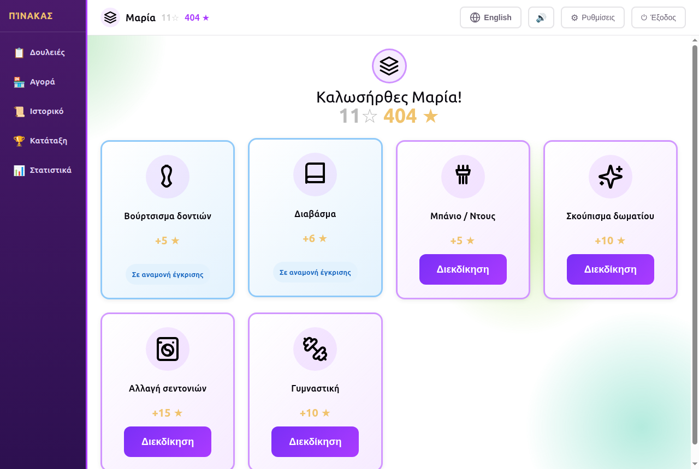

Each chore is a big card with an icon, its title, and its star value (e.g. `+5 ★`).
**Tap a card to flip it** and read the full description. A chore only appears when
it's currently "in window" — the app works out visibility live from the current
time, the chore's start time, and its duration window. There is no overnight batch
job; refresh the page and you see exactly what's claimable right now.

Cards show one of a few states:

- **A green "Διεκδίκηση / Claim" button** — ready for you to claim.
- **"Σε αναμονή έγκρισης / Pending approval"** — you've claimed it and a parent
  hasn't reviewed it yet.
- **"⏳ Διαθέσιμη ξανά σε… / Available again in…"** — you've already done this one
  for the period; the badge tells you when it comes back (next morning for daily
  chores, next week for weekly ones).
- **Someone else's name & avatar** — for "one kid" chores that a sibling already
  grabbed.

### Claiming a chore

Do the real-world task, then claim it in the app. The card flips to the details
side, you tap **Claim**, and it immediately switches to the pending state while a
parent reviews it.

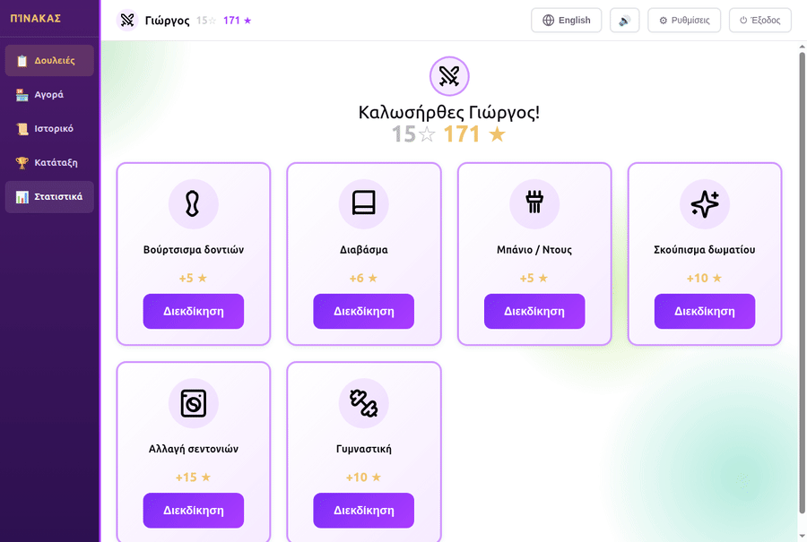

Once a parent approves it, your star balance animates upward — live, without
refreshing the page.

### Marketplace

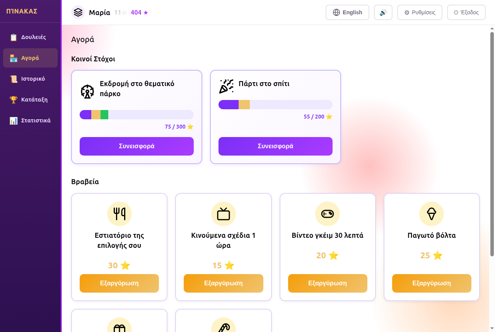

Spend your stars here. Each reward shows its cost. If you have enough stars the
**Redeem / Εξαργύρωση** button is bright and unlocked; if not, it's greyed out.

- **Individual rewards** deduct from your own balance and can be redeemed **once per
  day** — after redeeming, the card shows a "claimed today" badge and tells you when
  it's available again.
- **Collaborative ("epic") rewards** are shared goals (e.g. *Trip to the
  Waterpark — 500 ⭐*). Everyone can chip in stars toward one big combined progress
  bar.

When you redeem, the item goes into the parents' fulfillment queue so they know to
hand it over.

### History

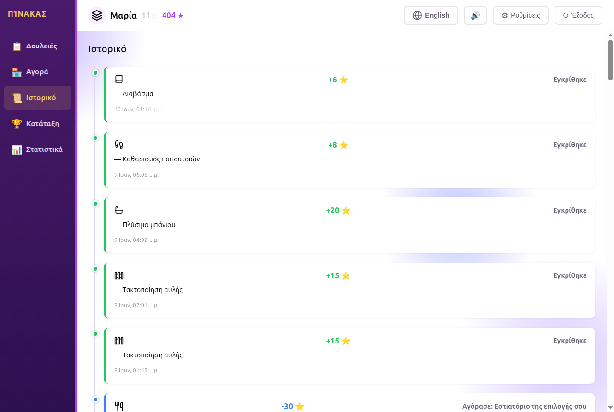

A transparent, time-ordered timeline of every star change: chores approved, rewards
bought, manual bonuses, and any retroactive declines (shown as a clear negative
entry with the parent's reason). Nothing is ever silently changed.

### Leaderboard

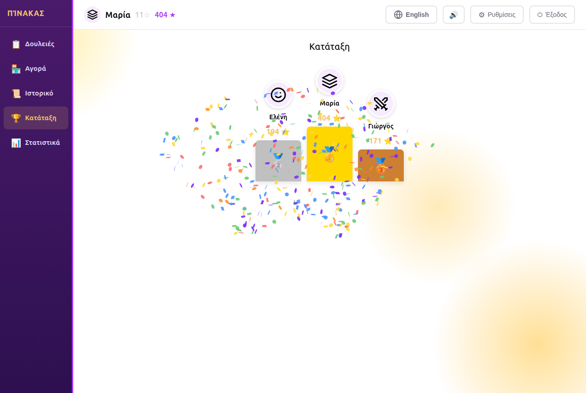

A live game-style podium ranking everyone by stars. It re-orders in real time the
instant a parent approves a chore on their phone — celebration confetti included.

### Stats

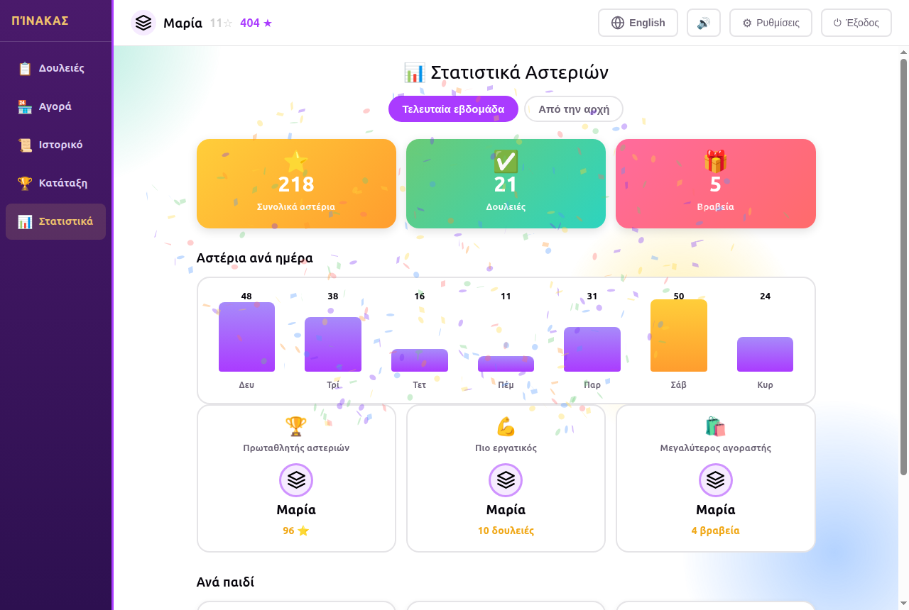

Colourful charts built from the history and reward ledgers:

- A **week / all-time** toggle.
- Totals for stars earned, chores done, and rewards bought.
- A per-weekday bar chart.
- "Champion" cards: top earner, hardest worker, top buyer.
- A per-kid breakdown — earned, spent, best day, best week.

---

## For parents (admin)

Logging in with a parent PIN opens the admin panel. It has its own tab set:
**Εγκρίσεις / Approvals**, **Δουλειές / Chores**, **Βραβεία / Rewards**,
**Χρήστες / Users**, **Εκτέλεση / Fulfillment**, **Δραστηριότητα / Activity**, and
**Στατιστικά / Stats** (the same charts the kids see). Every admin action pops a
toast confirmation.

### Approvals

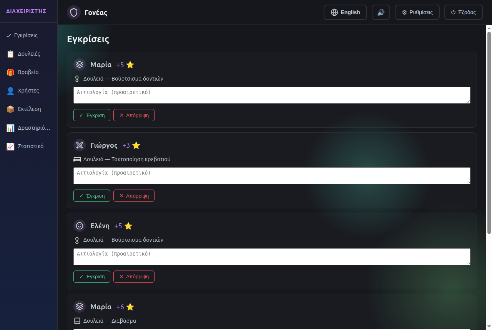

The heart of the day-to-day flow. Each pending claim shows the child, the chore, and
the stars at stake, with an optional reason box. Tap **✓ Έγκριση / Approve** to
award the stars (the child's screen updates live) or **✕ Απόρριψη / Decline** to
reject it.

### Managing chores

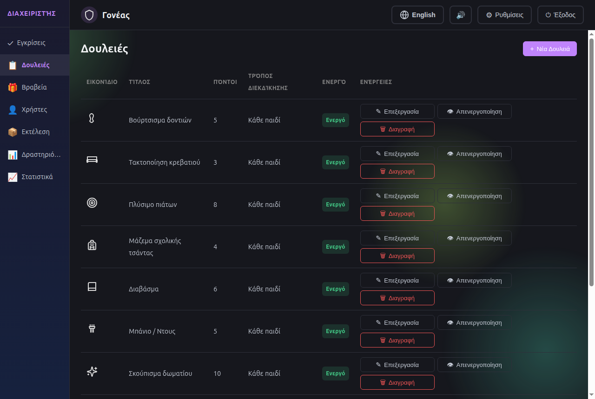

The chores table lists everything you've created, with quick **Edit / Disable /
Delete** actions. Tap **+ Νέα Δουλειά / New Chore** to open the creation form:

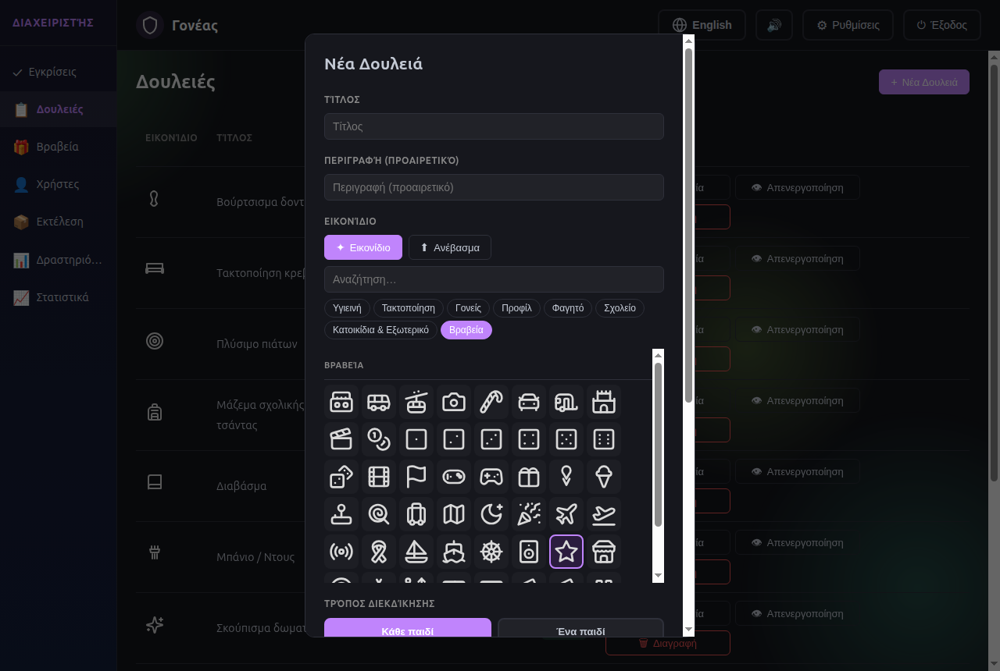

The form is built from touch-friendly toggle buttons rather than fiddly dropdowns:

- **Title & description** — type in whatever language you like (content isn't
  bilingual, only the app chrome is).
- **Icon** — search the built-in icon library by keyword so even a pre-reader
  recognises the task (a toothbrush, a bed, a book…).
- **Points** — how many stars it's worth.
- **Claim mode** — **Each kid** (everyone completes it independently) or
  **One kid** (first-come, first-served; others see who took it).
- **Repeating** — off, daily, or weekly with specific weekdays.
- **Schedule** — an optional start time and a duration window (None / 1h / 2h / 4h /
  8h) that together decide when the card is visible.

### Managing rewards

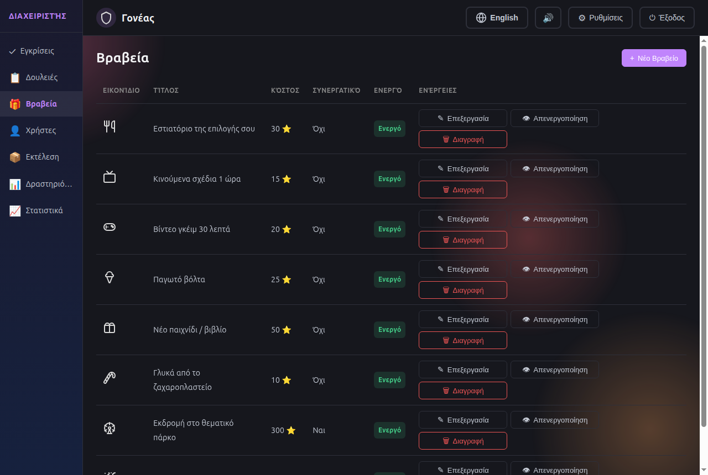

Create, edit, enable/disable, and delete rewards. Each has a title, a star cost, and
an **Is collaborative** toggle that turns it into a shared pooled goal instead of an
individual purchase.

### Managing users

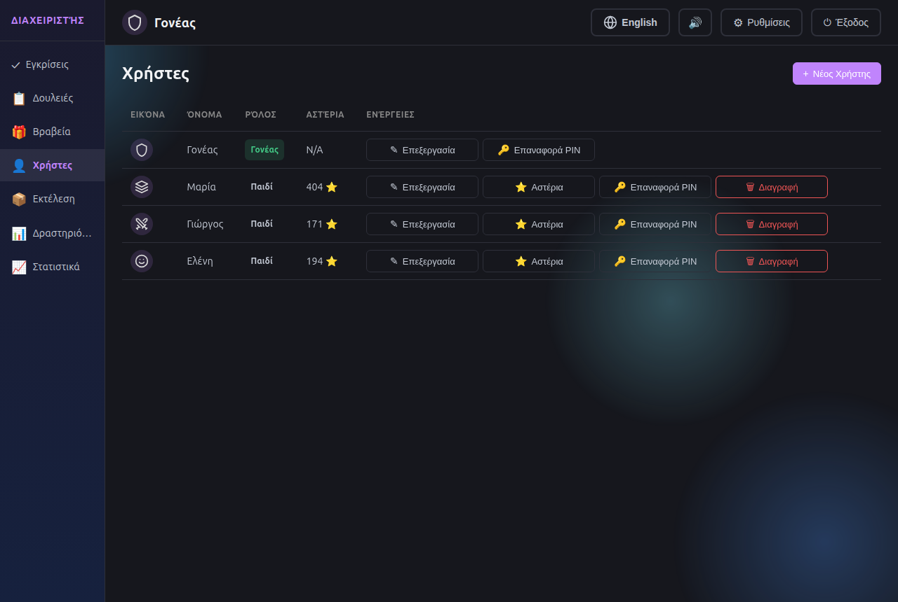

Add kids or other parents — set a name, an avatar (pick an icon or upload a photo),
and a role. Note:

- **Deletion is a soft delete** — a removed user is deactivated, never truly erased,
  so their history stays intact.
- You **can't delete yourself**, and the **last remaining admin can't be deleted**.

### Fulfillment

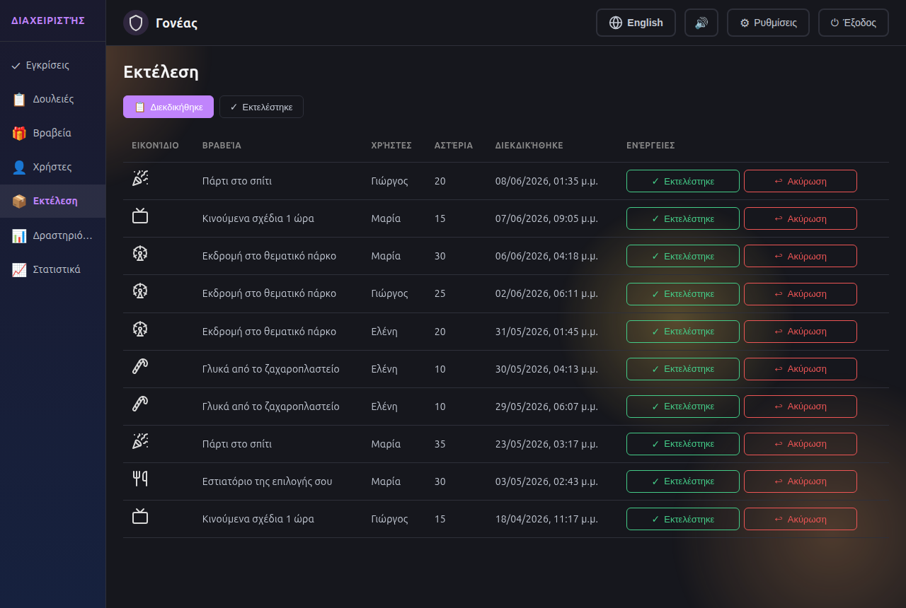

When a kid redeems a reward it lands here. Once you've actually handed over the prize
(or granted the screen time, etc.), tap **Mark as fulfilled** to move it into the
archive.

### Activity log

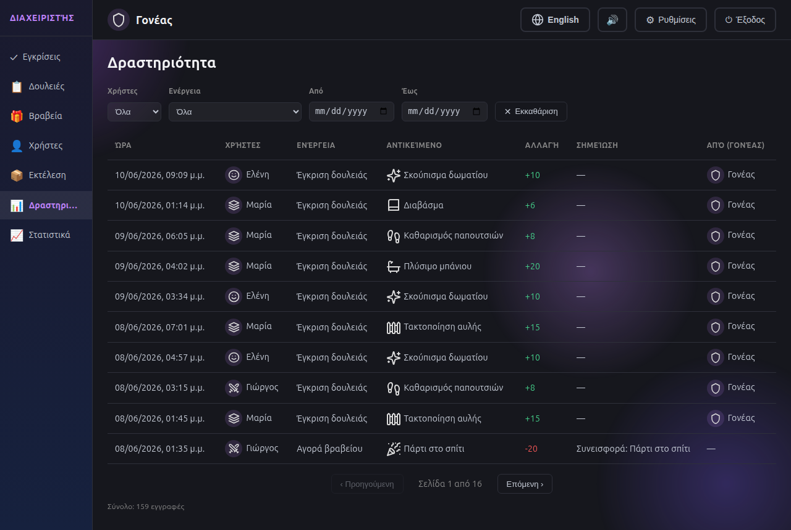

The complete, append-only ledger across the whole household — claims, approvals,
declines, redemptions, manual star adjustments — including a **"By"** column showing
which parent took each action. Paginated for long histories.

---

## Personal settings (everyone)

Tap the **⚙ Ρυθμίσεις / Settings** gear in the header. Kids and parents alike can:

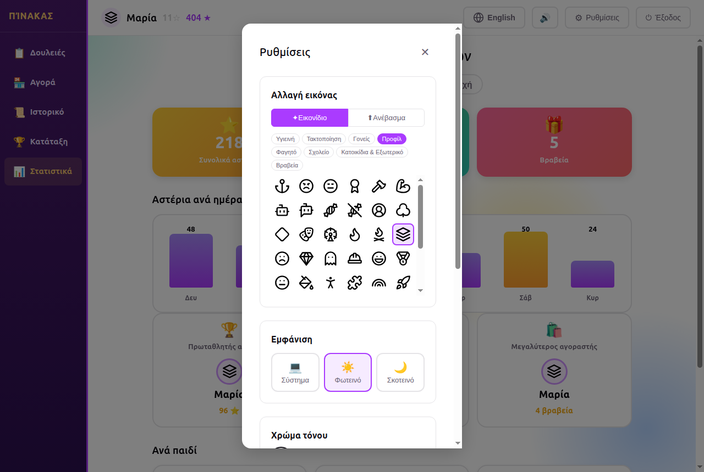

- **Change their avatar** — pick an icon from the library or upload & crop a photo.
- **Choose a theme** — System, Light, or Dark.
- **Pick an accent colour** — tints cards and buttons throughout their view.
- **Change their own PIN** — enter the current PIN, then the new one twice.

The **🔊 / 🔇** button next to the gear mutes or unmutes the app's sound effects (the
little tones on claims, redemptions, and card flips); the choice is remembered.

Every chore and reward card has a small **🔊 speaker button** in its top-right corner.
Tapping it reads the card's title and description aloud — handy for pre-readers — in
Greek or English depending on the text. This plays regardless of the mute setting above.

---

## On phones & tablets

The whole app is responsive. On narrow screens the sidebar collapses behind a menu
button and cards stack into a single column — the login grid, kid dashboard, and
admin panel all adapt.

| Login | Kid dashboard | Admin |
|---|---|---|
| 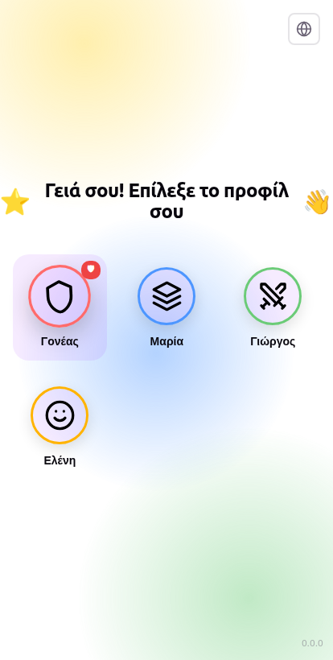 | 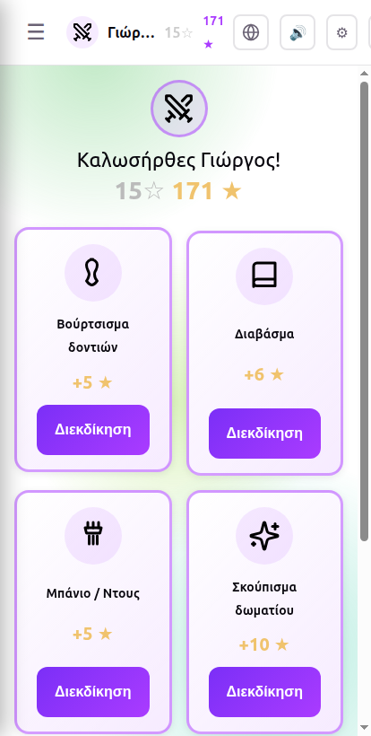 | 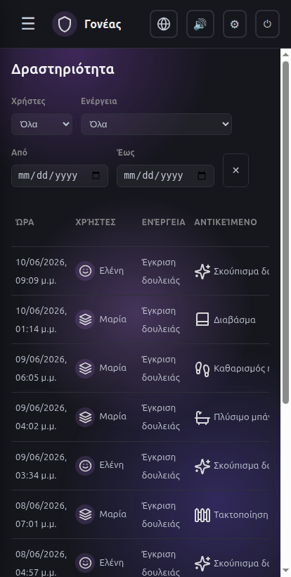 |

---

## Architecture overview

`padelerodouleies` is deliberately simple to run and maintain: **one Docker
container, one port, one database file**, served on the home LAN — no public
exposure, no external services.

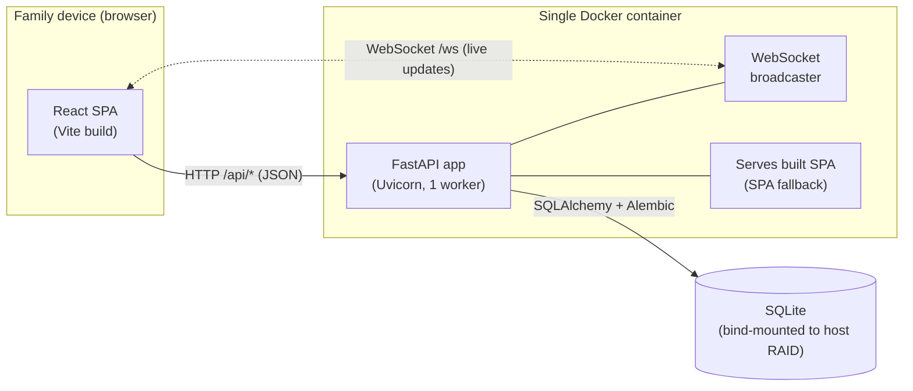
```mermaid
flowchart LR
    subgraph Browser["Family device (browser)"]
        SPA["React SPA<br/>(Vite build)"]
    end

    subgraph Container["Single Docker container"]
        API["FastAPI app<br/>(Uvicorn, 1 worker)"]
        WS["WebSocket<br/>broadcaster"]
        STATIC["Serves built SPA<br/>(SPA fallback)"]
        API --- WS
        API --- STATIC
    end

    DB[("SQLite<br/>(bind-mounted to host RAID)")]

    SPA -- "HTTP /api/* (JSON)" --> API
    SPA <-. "WebSocket /ws (live updates)" .-> WS
    API -- "SQLAlchemy + Alembic" --> DB
```

**How it fits together**

- The **frontend** is a single-page app. FastAPI serves the built static assets at
  `/` and falls back to `index.html` for client-side routes, so the same process
  delivers both the UI and the API.
- The **backend** exposes a JSON API under `/api/*` and a WebSocket at `/ws`.
- **Realtime** updates (a chore approved, a balance changing, the leaderboard
  re-ordering) are pushed to every connected client through an in-process pub/sub
  broadcaster — that's why a parent's approval instantly animates the kid's screen.
  Because the broadcaster lives in-process, the container runs a **single Uvicorn
  worker** on purpose.
- **Persistence** is an embedded **SQLite** file, bind-mounted from the container
  onto the host's RAID storage so data (and uploaded avatars/chore images) survives
  image rebuilds. The schema is five tables: `USERS`, `CHORES`, `CHORE_HISTORY`,
  `REWARDS`, and `REWARD_LEDGER`.

**Data model (simplified)**

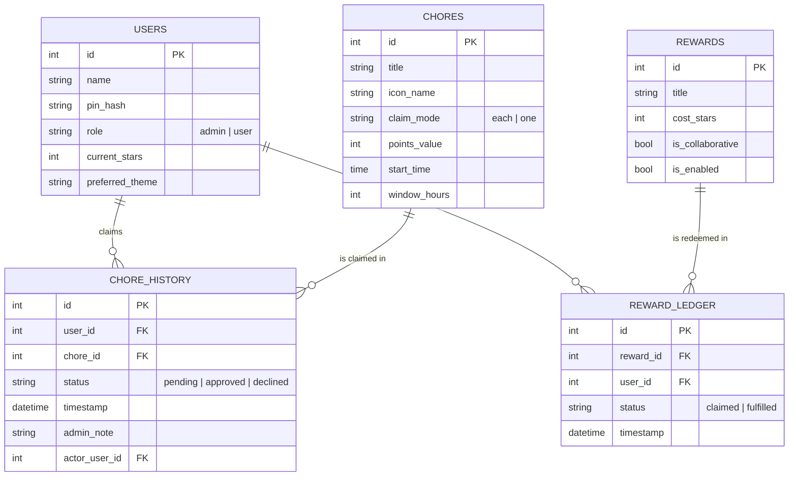
```mermaid
erDiagram
    USERS ||--o{ CHORE_HISTORY : "claims"
    CHORES ||--o{ CHORE_HISTORY : "is claimed in"
    USERS ||--o{ REWARD_LEDGER : "redeems"
    REWARDS ||--o{ REWARD_LEDGER : "is redeemed in"

    USERS {
        int id PK
        string name
        string pin_hash
        string role "admin | user"
        int current_stars
        string preferred_theme
    }
    CHORES {
        int id PK
        string title
        string icon_name
        string claim_mode "each | one"
        int points_value
        time start_time
        int window_hours
    }
    CHORE_HISTORY {
        int id PK
        int user_id FK
        int chore_id FK
        string status "pending | approved | declined"
        datetime timestamp
        string admin_note
        int actor_user_id FK
    }
    REWARDS {
        int id PK
        string title
        int cost_stars
        bool is_collaborative
        bool is_enabled
    }
    REWARD_LEDGER {
        int id PK
        int reward_id FK
        int user_id FK
        string status "claimed | fulfilled"
        datetime timestamp
    }
```

### Technology stack

| Layer | Technology |
|---|---|
| **Frontend** | Vite + React 19 + TypeScript (strict), React Router, TanStack Query, Zustand, React Hook Form + Zod, react-hot-toast, canvas-confetti |
| **Backend** | FastAPI on Uvicorn, SQLAlchemy 2 + Alembic, Pydantic v2, bcrypt (PIN hashing), Pillow (avatar/image processing) |
| **Database** | Embedded SQLite (bind-mounted to host) |
| **Realtime** | FastAPI WebSocket + in-process pub/sub broadcaster |
| **Packaging** | Single multi-stage Docker image (Node build stage → Python runtime), `docker-compose`, LAN-only |
| **i18n** | Server-side central translation dictionary; Greek (default) + English |

---

*Screenshots in this guide were captured from a development instance seeded with
sample data, so the names (Γονέας, Μαρία, Γιώργος, Ελένη) and figures are
illustrative.*
